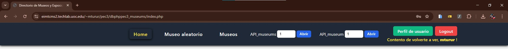
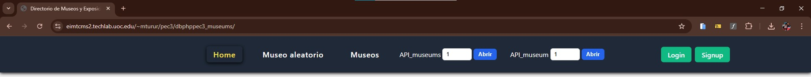
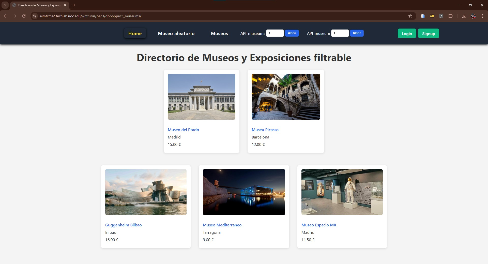
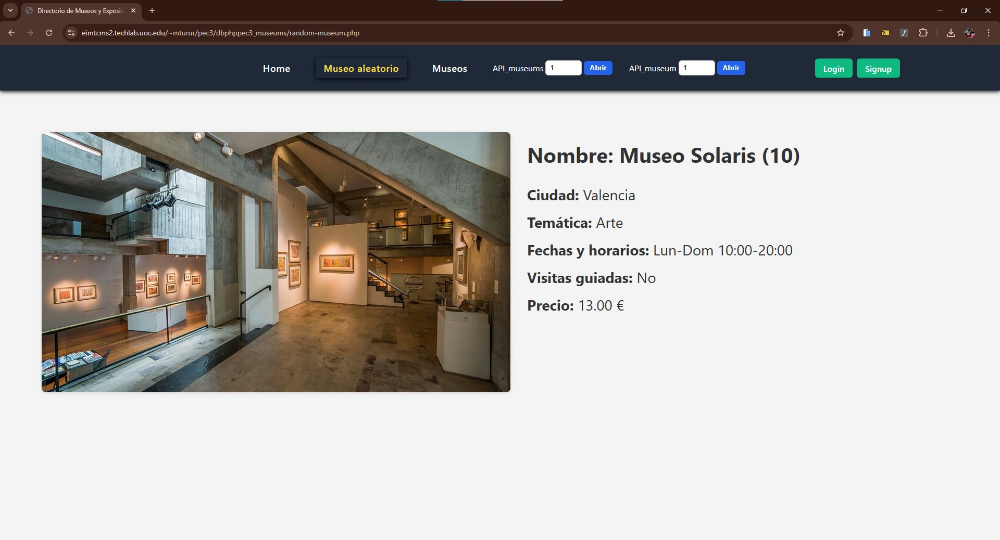
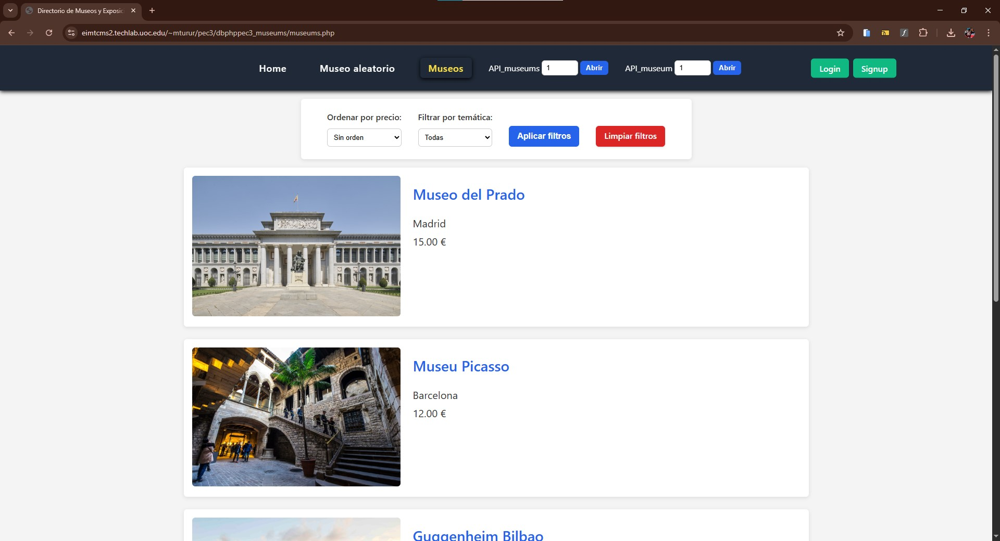
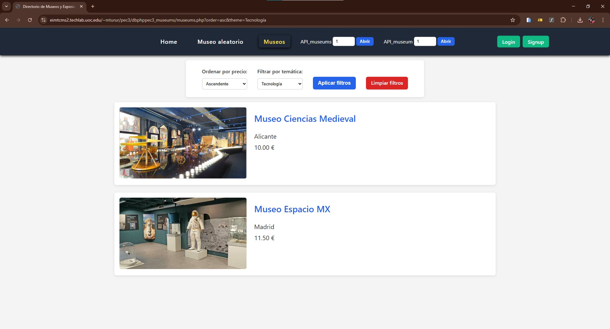
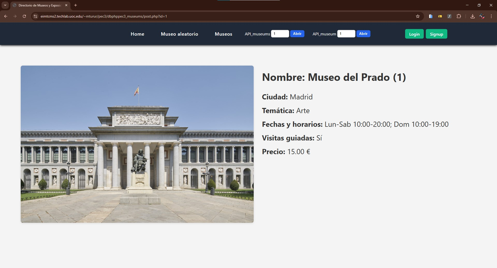
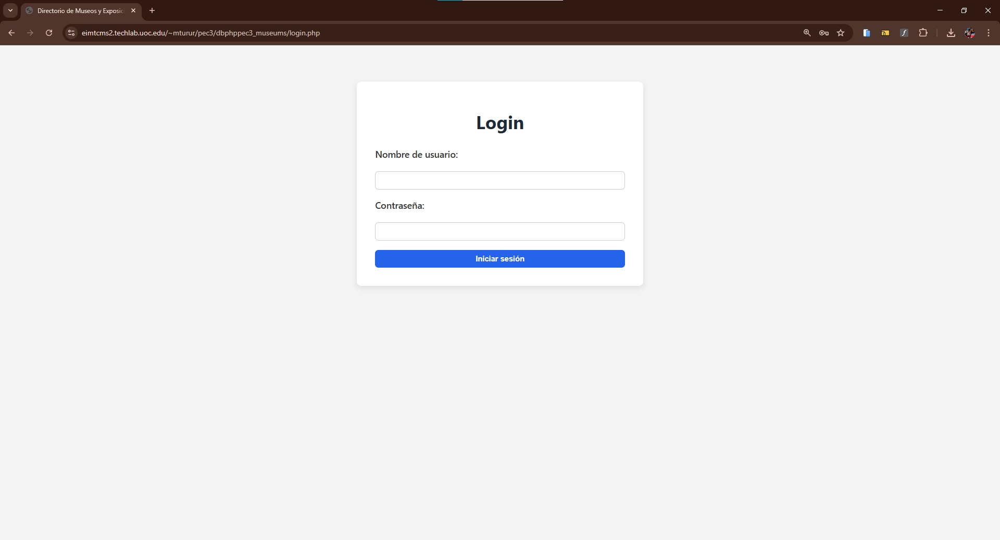
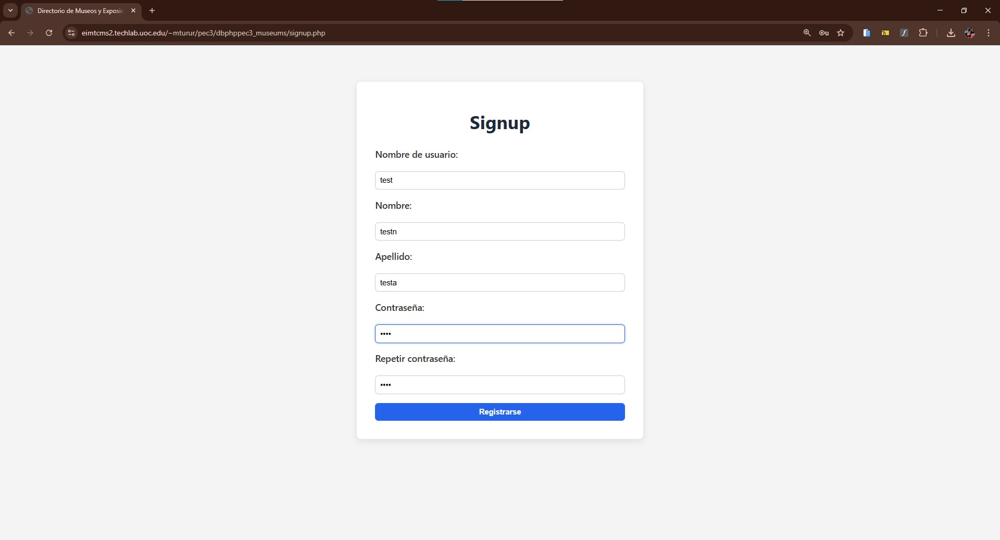
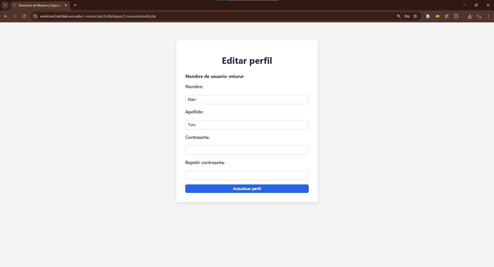

# 🏛️ PHPMuseums — Native PHP directory for museums & exhibitions

<sub>🗓️ Developed in December 2025</sub>

This project consists of a **PHP-based web application**.  
It implements a fully functional filterable directory of museums and exhibitions using **pure PHP**, **MySQL** (via PDO), HTML and CSS — covering database design, dynamic pages, REST API endpoints, user authentication, and server deployment.

---

## ✅ Features

- **MySQL Database**: Custom `museums_museos` table with fields for city, theme, schedule, guided visits, price, and image. Includes 10 museums (3 real: Museo del Prado, Museu Picasso, Guggenheim Bilbao) and 1 extra for pagination testing.
- **Random Museum Page**: Displays a randomly selected museum on each page load, showing all fields with image.
- **Home Page**: Shows 2 fixed real museums and 3 randomly rotating fictional museums, each with name (linked), city, price, and image.
- **Museums Catalogue**: Paginated list of museums (5 per page) with individual detail pages (`post.php?id=n`).
- **Sorting & Filtering**: Filter by theme and sort by price (ascending/descending) with a "clear filters" button to reset.
- **Navigation Menu**: Full navbar with links to: Home, Random Museum, Museums, API (museums + individual), Login, Signup, User Profile, and Logout. Shows a welcome message when logged in.
- **REST API**: Two read-only JSON endpoints — `/api/museums/<page>` (10 results/page) and `/api/museum/<id>` — both openable via the nav menu in a new tab. Tested with POSTMAN.
- **User Authentication**: Login and logout with session management, error handling, and SQL injection prevention via PDO prepared statements.
- **User Registration & Profile Editing**: Signup with encrypted passwords (`PASSWORD_BCRYPT`). Profile edit page allows updating name, surname, and password (username is non-editable).
- **Deployed**: Published and tested on the server at `https://eimtcms2.techlab.uoc.edu/~mturur/pec3/dbphppec3_museums/`.

---

## 🛠 Installation & Setup

> If you encounter any issues running the project locally, you can consult the original WAMP installation guide included at `DOCS/WAMPSetupGuide.pdf`.

### 0. Prerequisites

Make sure you have installed:
- **WAMP / LAMP / MAMP** (or equivalent local server stack)
- **PHP >= 8.x** with PDO and MySQL extensions enabled
- **MySQL** (via PhpMyAdmin or equivalent)

> ⚠️ On Windows, make sure `php -v` returns a version ≥ 8.x and that the `pdo_mysql` extension is enabled in `php.ini`.  
> ⚠️ If WAMP does not start correctly, it may require the Visual C++ Redistributable packages.

### 1. Clone the repository
```bash
git clone https://github.com/marcturu/php-museums.git
```

### 2. Relocate the project
Move or copy the project folder inside WAMP's `www` folder, e.g.:  
`C:\wamp64\www\php-museums`
> WAMP serves everything inside its `www` folder, so the `/php-museums` folder must be located there to access the project.

### 3. Create the database
Open **PhpMyAdmin** on WAMP and create a new database named `dbphppec3_db`. Then run the SQL script located at `db/dbphppec3_db.sql` to create the `museums_museos` and `museums_users` tables and insert all museum entries.

Alternatively, you can run the import manually from PhpMyAdmin:  
**Import → Select file → `db/dbphppec3_db.sql` → Go**

### 4. Configure the database connection (if necessary)
Edit `src/config/db_config.php` and set your local credentials, e.g.:
```php
$DB_HOST = "localhost";
$DB_NAME = "dbphppec3_db";
$DB_USER = "root";
$DB_PASS = "";
```

### 5. Access the site
Open your browser (or the WAMP server) and navigate to:
```
http://localhost/php-museums/
```

Test credentials (pre-registered user):
- **Username**: mturur
- **Password**: mturur

### 6. Live deployment
#### Current LIVE Status (2026) 

> ⚠️ **Important Note** The project was deployed on the server:
```
https://eimtcms2.techlab.uoc.edu/~mturur/pec3/dbphppec3_museums/
```
> Which was configured and maintained during 2025/26.  
> As of today, the application is no longer running on their servers (although the screenshots show how it used to).

---

## 📂 Project Structure

```
db/
└── dbphppec3_db.sql          ← Database dump (tables + data)
config/
└── db_config.php             ← DB connection (PDO)
includes/
├── header.php                ← Common HTML head + menu include
└── menu.php                  ← Navigation bar (session-aware)
api/
├── .htaccess                 ← URL rewriting for clean API routes
├── museums.php               ← /api/museums/<page> endpoint
└── museum.php                ← /api/museum/<id> endpoint
assets/
├── css/
│   └── style.css
└── img/                      ← Museum images
index.php                     ← Home page (featured museums)
random-museum.php             ← Random museum display
museums.php                   ← Paginated catalogue + filters
post.php                      ← Individual museum detail page
login.php                     ← Login form + session logic
logout.php                    ← Session destruction + redirect
signup.php                    ← User registration with hashed password
edit.php                      ← User profile editing
```

```
db/
└── dbphppec3_db.sql              ← Database dump (tables + data)
src/
├── api/
│   ├── .htaccess                 ← URL rewriting for clean API routes
│   ├── museums.php               ← /api/museums/<page> endpoint
│   └── museum.php                ← /api/museum/<id> endpoint
├── assets/
│   ├── css/
│   │   └── style.css
│   └── img/                      ← Museum images
├── config/
│   └── db_config.php             ← DB connection (PDO)
├── includes/
│   ├── header.php                ← Common HTML head + menu include
│   └── menu.php                  ← Navigation bar (session-aware)
├── edit.php
├── index.php                     ← Home page (featured museums)
├── login.php                     ← Login form + session logic
├── logout.php                    ← Session destruction + redirect
├── museums.php                   ← Paginated catalogue + filters
├── post.php                      ← Individual museum detail page
├── random-museum.php             ← Random museum display
└── signup.php                    ← User registration with hashed password
```

---

## 🔒 Security

- All database queries use **PDO prepared statements** with `bindValue()` to prevent SQL injection.
- User passwords are hashed using `password_hash($password, PASSWORD_BCRYPT)` on registration.
- Passwords are verified using `password_verify()` on login.
- All user-facing output is sanitized with `htmlspecialchars()` to prevent XSS.

---

## 📷 Screenshots

### Menu w/ user:


### Menu w/o user:


### Home:


### Random Museum:


### Museums Catalogue (no filters):


### Museums Catalogue (filtered):


### Museum Detail Page:


### API Museums (page 1):


### API Museum (id 1):


### POSTMAN — API Museums:


### POSTMAN — API Museum:


### Login:


### Signup:


### Edit Profile:


---

### Database — museums_museos table:


### Database — museums_users table:


---

## ⚖️ Copyright & License

© 2025 Marc Turu Roca. All rights reserved.

This project and its contents are the exclusive intellectual property of Marc Turu Roca.  
All rights reserved. No part of this project may be copied, modified, distributed, or used without prior written permission from the author.
